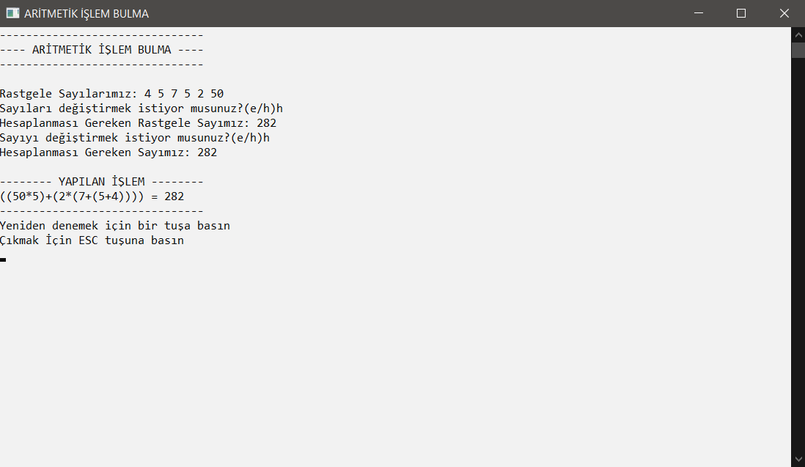
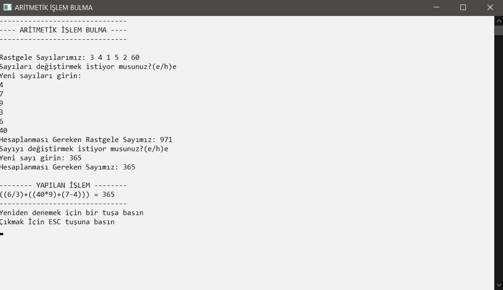
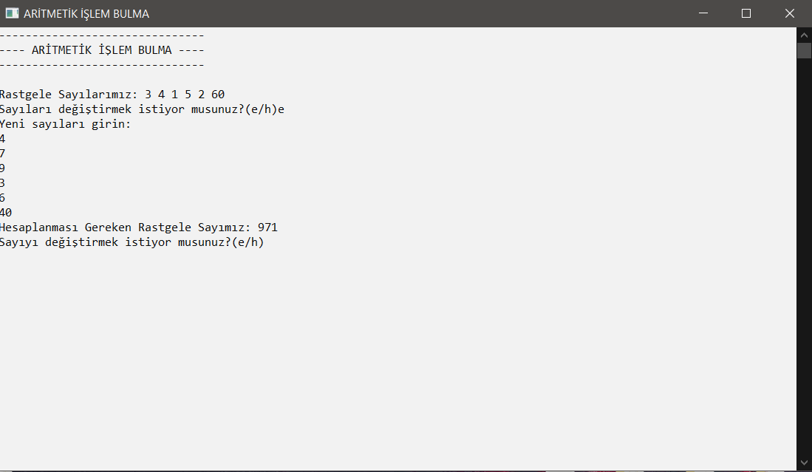
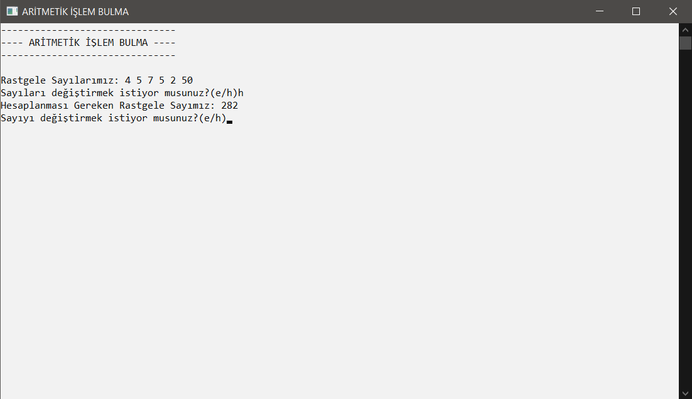
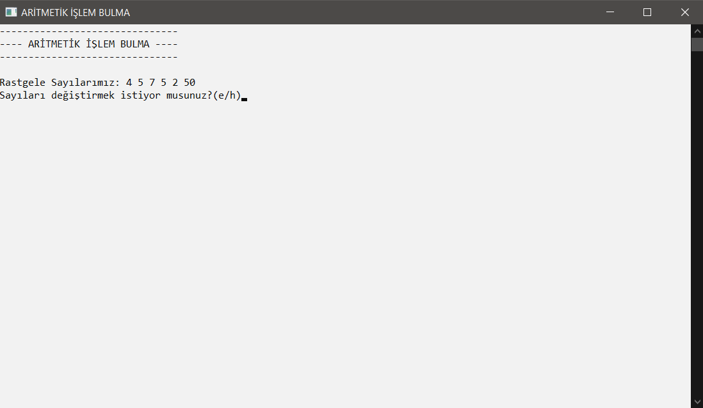

# Four Operations Calculation Game

  The computer randomly generates 5 numbers between 1-9, 1 number between 10-90 as a multiple of 10, and one 3-digit number between 100-999. It prints them on the console screen, and if desired, the user can enter the numbers to be processed and the number he/she wants to be found. 
  
  The computer takes the numbers to be processed and adds four operation expressions and parentheses between each number. For example, 1+2, 1-2, 1*2, 1/2, (1+2)*(1-2). It does this for 6 numbers and checks whether the desired result is obtained by converting this string value to an int value in each operation. If the desired value is correct, it is printed on the screen and the program terminates.

## Screenshots

## Author

- Linkedin: [@acarbaran](https://www.linkedin.com/in/acarbaran/)

## Contributing

Contributions, issues and feature requests are welcome!
Feel free to check `issues page`
  
## License

Copyright © 2022 all rights reserved

